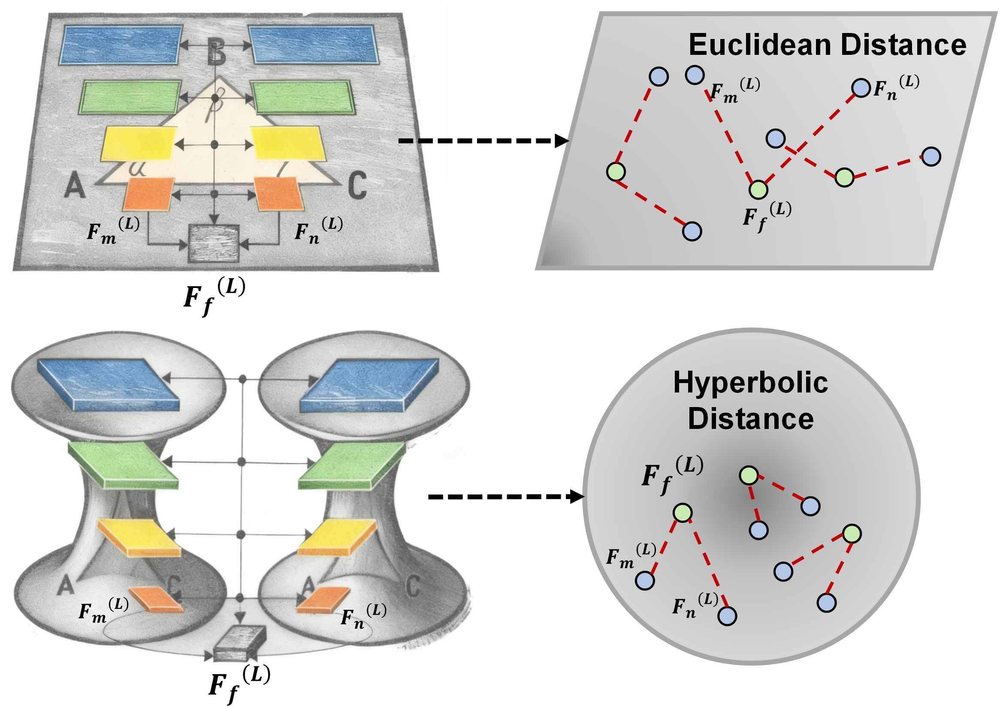
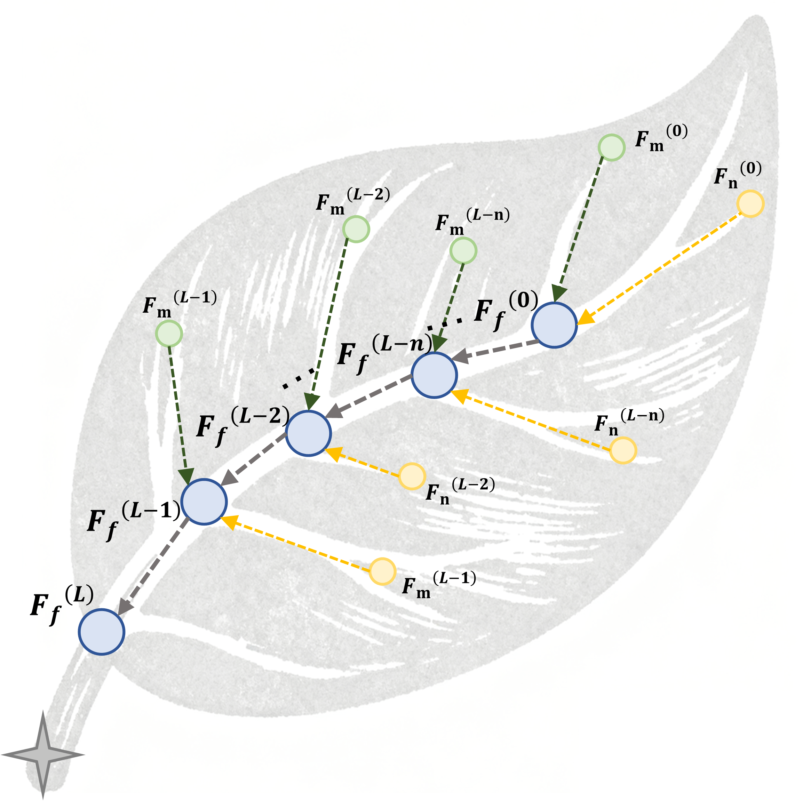
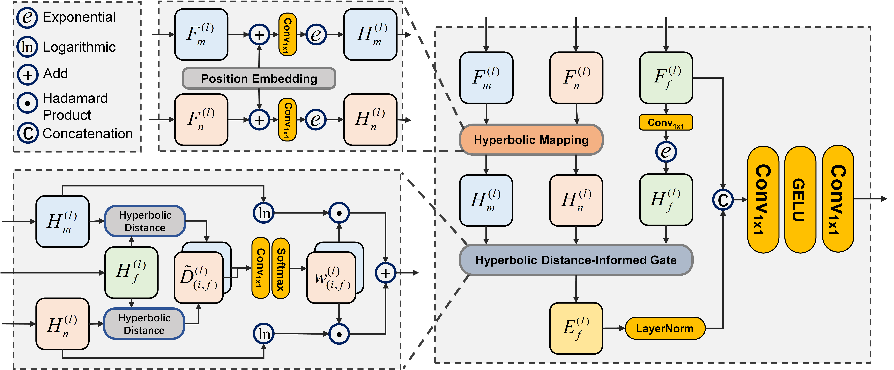
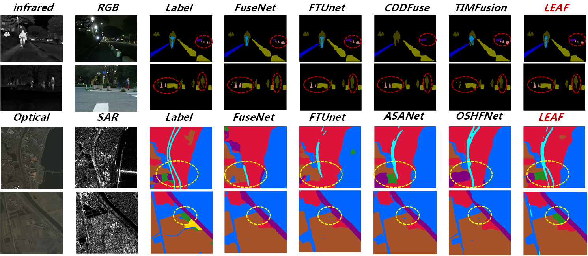
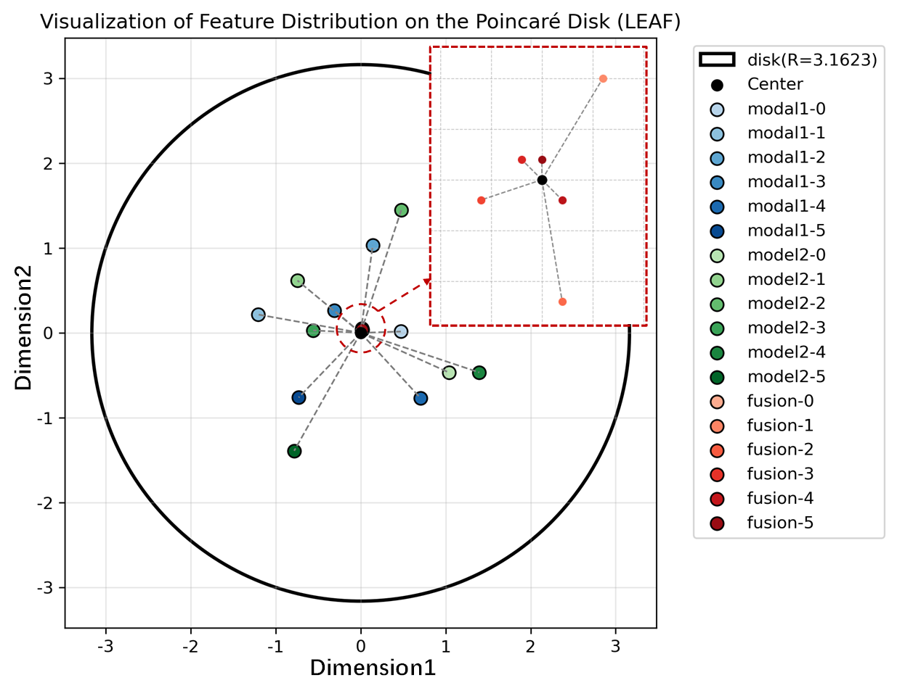
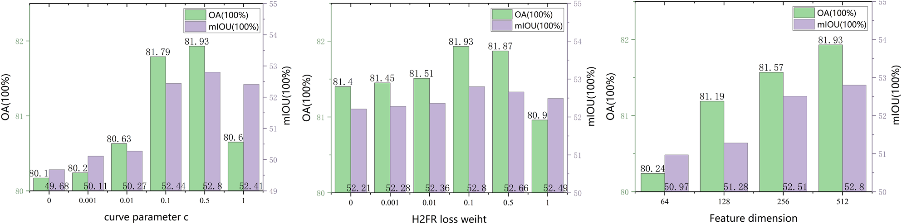

# LEAF:Laminar-structured Euclidean-hyperbolic geometry-Aware feature Fusion framework


Multimodal Image Feature Fusion (MIFF) could achieve complementary advantages of different modalities, thus gaining extensive attention and application in various fields such as remote sensing observation, medical image processing, autonomous driving and so on. However, existing MIFF paradigms are mainly executed in the "flat" Euclidean space. Thus, they neglect to capture the inherent hierarchical semantic relationships between features of different levels and modalities, which distort their prior spatial layout within the feature space and further limit model performance. To address the problem, benefiting from the ability of modeling laminar structures endowed by the negative curvature, we introduce the hyperbolic geometry learning to MIFF for the first time and propose Laminar-structured Euclidean-hyperbolic geometry-Aware feature Fusion framework (LEAF). Specifically, we model the fusion features with layer-by-layer progression and their corresponding unimodal features as a leaf-like structure in hyperbolic feature space, and design a novel global spatial ranking constraint, which named Hyperbolic Hierarchical Fused-core Ranking (H2FR) Loss. Additionally, we develop Hyperbolic Distance-informed Gating Fusion Block (HDGFB), which could be used as an extension of conventional feature fusion components to effectively introduce local spatial geometric information.  The contributions of our work in this paper can be summarized as the following three points:

1. We highlight the potential flaw in conventional MIFF methods, in which Euclidean-space-based distorts feature hierarchical structures, and make the first attempt to propose the LEAF, a novel MIFF method based on hyperbolic space.
2. We model layer-by-layer progressive fusion features and their corresponding unimodal features as a leaf-like structure in hyperbolic space, and develop H2FR loss, a novel spatial ordering constraint based on geodesic distance.
3. item We develop HDGFB, which serves as an extended component that seamlessly integrates with various MIFF fusion modules to introduce hyperbolic geometric information into fusion features.


## Basic caculation in the hyperbolic space



```
class HyperbolicUtils(nn.Module):

    def __init__(self, c=1.0):
        super().__init__()
        self.c = c
        self.eps = 1e-8
        self.sqrt_c = math.sqrt(c)

    def euclid_to_hyper(self, x):
        norm_x = torch.norm(x, dim=1, keepdim=True, p=2) 
        max_allowed_norm = 1.0 / math.sqrt(self.c) - self.eps 
        
        scale = torch.min(torch.ones_like(norm_x), max_allowed_norm / (norm_x + self.eps))
        x_scaled = x * scale
        scaled_norm = math.sqrt(self.c) * torch.norm(x_scaled, dim=1, keepdim=True, p=2)
        tanh_term = torch.tanh(scaled_norm)
        safe_norm = torch.norm(x_scaled, dim=1, keepdim=True, p=2) + self.eps
        return (tanh_term / (math.sqrt(self.c) * safe_norm)) * x_scaled

    def hyper_to_euclid(self, x):
        norm_x = torch.norm(x, dim=1, keepdim=True, p=2).clamp(min=self.eps, max=1 - self.eps)
        return (1 / math.sqrt(self.c)) * torch.arctanh(math.sqrt(self.c) * norm_x) * (x / norm_x)

    def hyper_distance(self, u, v):
        max_norm = (1.0 / math.sqrt(self.c)) - self.eps 
        norm_u = torch.norm(u, dim=1, keepdim=True, p=2).clamp(max=max_norm)
        norm_v = torch.norm(v, dim=1, keepdim=True, p=2).clamp(max=max_norm)
        
        uv = torch.sum(u * v, dim=1, keepdim=True)
        
        numerator = 1 + 2 * self.c * torch.sum((u - v) **2, dim=1, keepdim=True)
        denominator = (1 - self.c * norm_u** 2) * (1 - self.c * norm_v **2)
        arg = (numerator / denominator).clamp(min=1 + self.eps)
        distance = (1 / math.sqrt(self.c)) * torch.acosh(arg)
        
        return distance.mean()

    def hyper_distance_scale(self, u, v):
        max_norm = (1.0 / math.sqrt(self.c)) - self.eps 
        eps = self.eps
        
        norm_u_original = torch.norm(u, dim=1, keepdim=True, p=2) + eps
        target_norm_u = torch.min(norm_u_original, torch.full_like(norm_u_original, max_norm))
        scale_u = target_norm_u / norm_u_original）
        u_scaled = u * scale_u
        
        norm_v_original = torch.norm(v, dim=1, keepdim=True, p=2) + eps
        target_norm_v = torch.min(norm_v_original, torch.full_like(norm_v_original, max_norm))
        scale_v = target_norm_v / norm_v_original
        v_scaled = v * scale_v
        norm_u = torch.norm(u_scaled, dim=1, keepdim=True, p=2).clamp(max=max_norm)
        norm_v = torch.norm(v_scaled, dim=1, keepdim=True, p=2).clamp(max=max_norm)
        uv = torch.sum(u_scaled * v_scaled, dim=1, keepdim=True)
        numerator = 1 + 2 * self.c * torch.sum((u_scaled - v_scaled) **2, dim=1, keepdim=True)
        denominator = (1 - self.c * norm_u** 2) * (1 - self.c * norm_v **2)
        arg = (numerator / denominator).clamp(min=1 + eps)
        distance = (1 / math.sqrt(self.c)) * torch.acosh(arg)
        
        return distance.mean()

    def distance_to_origin(self, x):
        norm_x = torch.norm(x, dim=1, keepdim=True, p=2)
        max_norm = (1.0 / math.sqrt(self.c)) - self.eps
        # norm_x_clamped = norm_x.clamp(max=max_norm)
        scale = torch.min(torch.ones_like(norm_x), max_norm / (norm_x + self.eps))
        norm_x_scaled = norm_x * scale
        
        distance = (1.0 / math.sqrt(self.c)) * torch.arctanh(math.sqrt(self.c) * norm_x_scaled)
        return distance.mean()
    
    def distance_to_origin_norm(self, x):
        norm_x = torch.norm(x, dim=1, keepdim=True, p=2)
        return norm_x.mean()

    def mobius_add(self, u, v):
        u = u / (1 + 1e-8)
        v = v / (1 + 1e-8)

        norm_u_sq = torch.sum(u ** 2, dim=1, keepdim=True)
        norm_v_sq = torch.sum(v ** 2, dim=1, keepdim=True)
        uv_dot = torch.sum(u * v, dim=1, keepdim=True)

        numerator = (1 + 2 * self.sqrt_c * uv_dot + self.c * norm_v_sq) * u + \
                    (1 - self.c * norm_u_sq) * v
        denominator = 1 + 2 * self.sqrt_c * uv_dot + (self.c ** 2) * norm_u_sq * norm_v_sq

        return numerator / (denominator + 1e-8)

```

## Hyperbolic Hierarchical Fused-core Ranking (H2FR) Loss

The H2FR loss can be divided into the following two parts: For the ranking between multi-level fused features, inspired by the ListMLE loss, we aim to set the predefined distance ranking as the target and, based on the maximum likelihood estimation, maximize the probability that the current distance ranking is consistent with the target. For the distance in the same level, we use the Top-1 strategy to construct distance constraints between multiple features in the same layer inspired by the LisNet. 




The core codes are below:

```
def top1_loss(predicts, target_index):
    """
    Top-1 
    predicts: (B, L)
    target_index: (B,)
    """
    log_probs = torch.log_softmax(predicts, dim=1)  # (B, L)
    loss = -log_probs[torch.arange(predicts.size(0)), target_index]
    return loss.mean()

def listwise_ranking_loss(predicts, targets):
    _, indices = torch.sort(targets, dim=1, descending=False) 
    predicts_sorted = torch.gather(predicts, dim=1, index=indices)
    y = predicts_sorted
    y_reverse = y.flip(dims=[1])
    cum_logsumexp = torch.logcumsumexp(y_reverse, dim=1)
    cum_logsumexp = cum_logsumexp.flip(dims=[1])
    loss_per_position = - (y - cum_logsumexp)
    loss = loss_per_position.mean()

    return loss

class RankingBasedGeometryLoss(nn.Module):
    def __init__(self, alpha=1.0, beta=1.0, gamma=1.0, c=0.5):
        super().__init__()
        self.hyper_utils = HyperbolicUtils(c)
        self.alpha = alpha 
        self.beta = beta    
        self.gamma = gamma  

    def forward(self, hyper_fused, hyper_features1, hyper_features2):
        total_loss = 0.0
        num_levels = len(hyper_fused)
        ideal_level_ranks = torch.arange(num_levels-1, -1, -1, device=hyper_fused[0].device)
        predicted_level_scores = torch.stack([
            -self.hyper_utils.distance_to_origin_norm(feat) 
            for feat in hyper_fused
        ])

        predicted_level_scores = predicted_level_scores.unsqueeze(0)  # (1, num_levels)
        ideal_level_ranks = ideal_level_ranks.unsqueeze(0)
        
        level_loss = listwise_ranking_loss(predicted_level_scores, ideal_level_ranks)
        total_loss += self.alpha * level_loss

        for i in range(num_levels):
            # ideal_coreness_ranks = torch.tensor([0, 1, 1], device=hyper_fused[0].device)
            predicted_core_scores = torch.stack([
                -self.hyper_utils.distance_to_origin_norm(hyper_fused[i]),
                -self.hyper_utils.distance_to_origin_norm(hyper_features1[i]),
                -self.hyper_utils.distance_to_origin_norm(hyper_features2[i])
            ]).unsqueeze(0)
            
            target_index = torch.tensor([0], device=predicted_core_scores.device).unsqueeze(0)
            coreness_loss = top1_loss(predicted_core_scores, target_index)
            total_loss += self.beta * coreness_loss
        
        return total_loss
```

## Hyperbolic Distance-informed Gating Fusion Block (HDGFB)

The aforementioned H2FR loss emphasizes the global hierarchical relationships of semantic relevance among features obtained through MIFF. However, the semantic hierarchies present in local features also warrant careful consideration. Specifically, during feature fusion, certain modalities may exhibit regional priority—that is, in different local areas of multimodal images, the importance of each modality can vary dynamically. Conventional fusion methods may struggle to capture this localized dynamic priority, due to the incorrect portrayal of semantic hierarchical relationship by the Euclidean distance. To overcome this limitation, we introduce the HDGFB, which leverages the natural correspondence in hyperbolic space between distance and semantic relevance. By incorporating spatially localized hyperbolic distances, HDGFB activates gated feature fusion, thereby integrating geometric spatial information directly into the fusion process.



The core codes are below:

```
class HyperbolicAttentionFusion(nn.Module):
    def __init__(self, in_channels, hyper_c=0.2, hidden_dim=512):
        super().__init__()
        self.hyper_utils = HyperbolicUtils(c=hyper_c)
        self.in_channels = in_channels

        self.to_hyperbolic1 = nn.Sequential(
            nn.Conv2d(in_channels, in_channels, kernel_size=1),
        )
        self.to_hyperbolic2 = nn.Sequential(
            nn.Conv2d(in_channels, in_channels, kernel_size=1),
        )

        self.to_hyperbolic3 = nn.Sequential(
            nn.Conv2d(in_channels, in_channels, kernel_size=1),
        )

        self.distance_activation = nn.Sigmoid()

        self.distance_mlp = nn.Sequential(
            nn.Conv2d(2, 2, kernel_size=1),
        )

        self.ff = nn.Sequential(
            nn.Conv2d(2 * in_channels, hidden_dim, kernel_size=1),
            nn.GELU(),
            nn.Conv2d(hidden_dim, in_channels, kernel_size=1),
        )

        self.tangent_norm = nn.LayerNorm([in_channels])

    def hyper_distance_map(self, u, v):

        B, C, H, W = u.shape
        eps = 1e-6  
        c = self.hyper_utils.c 
        max_norm = (1.0 / math.sqrt(c)) - eps 

        u_reshaped = u.permute(0, 2, 3, 1)  # (B, H, W, C)
        v_reshaped = v.permute(0, 2, 3, 1)  # (B, H, W, C)

        norm_u_original = torch.norm(u_reshaped, dim=3, keepdim=True) + eps  # (B, H, W, 1)，
        target_norm_u = torch.min(norm_u_original, torch.full_like(norm_u_original, max_norm))
        scale_u = target_norm_u / norm_u_original
        u_scaled = u_reshaped * scale_u  # (B, H, W, C)

        norm_v_original = torch.norm(v_reshaped, dim=3, keepdim=True) + eps  # (B, H, W, 1)
        target_norm_v = torch.min(norm_v_original, torch.full_like(norm_v_original, max_norm))
        scale_v = target_norm_v / norm_v_original
        v_scaled = v_reshaped * scale_v  # (B, H, W, C)

        norm_u = torch.norm(u_scaled, dim=3, keepdim=True).clamp(max=max_norm)  # (B, H, W, 1)
        norm_v = torch.norm(v_scaled, dim=3, keepdim=True).clamp(max=max_norm)  # (B, H, W, 1)

        uv_dot = torch.sum(u_scaled * v_scaled, dim=3, keepdim=True)  # (B, H, W, 1)

        diff_norm_sq = torch.sum((u_scaled - v_scaled) **2, dim=3, keepdim=True)  # (B, H, W, 1)

        numerator = 1 + 2 * c * diff_norm_sq
        denominator = (1 - c * norm_u** 2) * (1 - c * norm_v **2)

        inside_acosh = (numerator / denominator).clamp(min=1 + eps)

        distance = (1 / math.sqrt(c)) * torch.acosh(inside_acosh)  # (B, H, W, 1)

        distance_map = distance.permute(0, 3, 1, 2)  # (B, 1, H, W)

        return distance_map

    def forward(self, euclidean_fused, feat1, feat2):

        B, C, H, W = euclidean_fused.shape

        query_hyper = self.hyper_utils.euclid_to_hyper(
            self.to_hyperbolic1(euclidean_fused).permute(0, 2, 3, 1).reshape(-1, self.in_channels)
        ).reshape(euclidean_fused.size(0), euclidean_fused.size(2),
                  euclidean_fused.size(3), -1).permute(0, 3, 1, 2)

        feat1_hyper = self.hyper_utils.euclid_to_hyper(
            self.to_hyperbolic2(feat1).permute(0, 2, 3, 1).reshape(-1, self.in_channels)
        ).reshape(feat1.size(0), feat1.size(2), feat1.size(3), -1).permute(0, 3, 1, 2)

        feat2_hyper = self.hyper_utils.euclid_to_hyper(
            self.to_hyperbolic3(feat2).permute(0, 2, 3, 1).reshape(-1, self.in_channels)
        ).reshape(feat2.size(0), feat2.size(2), feat2.size(3), -1).permute(0, 3, 1, 2)

        dist1_map = self.hyper_distance_map(query_hyper, feat1_hyper)  # (B, 1, H, W)
        dist2_map = self.hyper_distance_map(query_hyper, feat2_hyper)  # (B, 1, H, W)

        dist_sum = dist1_map + dist2_map + 1e-8 
        rel_dist1 = dist1_map / dist_sum 
        rel_dist2 = dist2_map / dist_sum

        weights = torch.cat([-rel_dist1, -rel_dist2], dim=1)  # (B, 2, H, W)
        weights = self.distance_mlp(weights)
        normalized_weights = torch.softmax(weights, dim=1)
        weight1, weight2 = normalized_weights[:, 0:1, ...], normalized_weights[:, 1:2, ...]

        feat1_hyper_flat = feat1_hyper.permute(0, 2, 3, 1).reshape(-1, C)  # (B*H*W, C)
        feat2_hyper_flat = feat2_hyper.permute(0, 2, 3, 1).reshape(-1, C)  # (B*H*W, C)
        
        feat1_tangent = self.hyper_utils.hyper_to_euclid(feat1_hyper_flat)  # (B*H*W, C)
        feat2_tangent = self.hyper_utils.hyper_to_euclid(feat2_hyper_flat)  # (B*H*W, C)

        weight1_flat = weight1.permute(0, 2, 3, 1).reshape(-1, 1)  # (B*H*W, 1)
        weight2_flat = weight2.permute(0, 2, 3, 1).reshape(-1, 1)  # (B*H*W, 1)

        fused_tangent = weight1_flat * feat1_tangent + weight2_flat * feat2_tangent  # (B*H*W, C)
        fused_tangent = fused_tangent.reshape(B, H, W, C).permute(0, 3, 1, 2)  # (B, C, H, W)
        fused_euclidean = self.tangent_norm(fused_tangent.permute(0, 2, 3, 1)).permute(0, 3, 1, 2)
        fused_feature = torch.cat([fused_euclidean, euclidean_fused], dim=1)  # (B, 2C, H, W)
        fused_feature = self.ff(fused_feature)

        return fused_feature
```
## Experiment results








