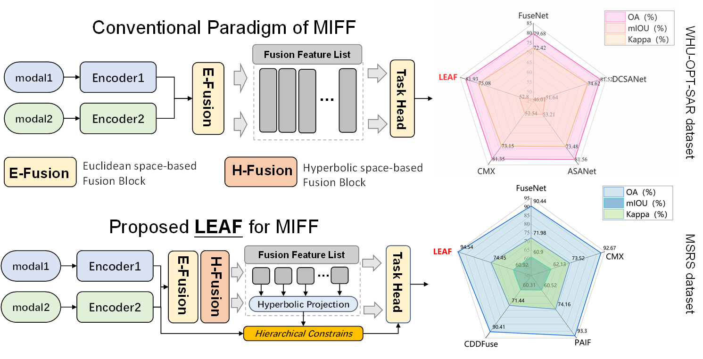

# LEAF:Laminar-structured Euclidean-hyperbolic geometry-Aware feature Fusion framework

Multimodal Image Feature Fusion (MIFF) could achieve complementary advantages of different modalities, thus gaining extensive attention and application in various fields such as remote sensing observation, medical image processing, autonomous driving and so on. However, existing MIFF paradigms are mainly executed in the "flat" Euclidean space. Thus, they neglect to capture the inherent hierarchical semantic relationships between features of different levels and modalities, which distort their prior spatial layout within the feature space and further limit model performance. To address the problem, benefiting from the ability of modeling laminar structures endowed by the negative curvature, we introduce the hyperbolic geometry learning to MIFF for the first time and propose Laminar-structured Euclidean-hyperbolic geometry-Aware feature Fusion framework (LEAF). Specifically, we model the fusion features with layer-by-layer progression and their corresponding unimodal features as a leaf-like structure in hyperbolic feature space, and design a novel global spatial ranking constraint, which named Hyperbolic Hierarchical Fused-core Ranking (H2FR) Loss. Additionally, we develop Hyperbolic Distance-informed Gating Fusion Block (HDGFB), which could be used as an extension of conventional feature fusion components to effectively introduce local spatial geometric information.  The contributions of our work in this paper can be summarized as the following three points:

1. We highlight the potential flaw in conventional MIFF methods, in which Euclidean-space-based distorts feature hierarchical structures, and make the first attempt to propose the LEAF, a novel MIFF method based on hyperbolic space.
2. We model layer-by-layer progressive fusion features and their corresponding unimodal features as a leaf-like structure in hyperbolic space, and develop H2FR loss, a novel spatial ordering constraint based on geodesic distance.
3. item We develop HDGFB, which serves as an extended component that seamlessly integrates with various MIFF fusion modules to introduce hyperbolic geometric information into fusion features. 

